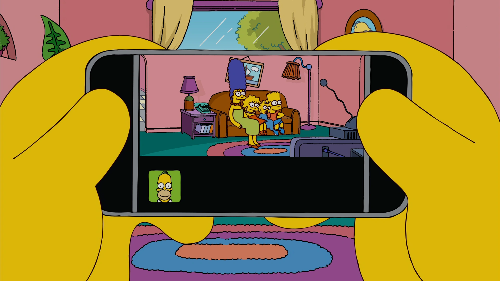

# Vue 3 + TypeScript + Vite

[](.github/my-phone.webp)

A modern phone UI component built with Vue 3, TypeScript, and Vite. This component provides a realistic phone interface with various interactive features.

## Features

- 📱 Realistic phone UI with notch and side buttons
- 🔔 Notification system with customizable options
- 🎨 Customizable background and carrier name
- 🔄 Fullscreen mode support
- 📳 Vibration and sound effects
- 🔋 Battery and network indicators
- 🔒 Lock screen functionality
- 📏 Customizable phone size
- 🎯 Popup system

## Installation

```bash
npm install vue-my-phone
```

## Usage

```vue
<script setup lang="ts">
import { ref } from 'vue'
import type { Phone } from 'vue-my-phone'
import PhoneComponent from 'vue-my-phone'

const phone_ref = ref<Phone | null>(null)
</script>

<template>
  <PhoneComponent ref="phone_ref">
    <!-- Your content here -->
  </PhoneComponent>
</template>
```

## API Reference

### Methods

#### Notifications
- `add_notification(notification: Notification)`: Adds a notification to the phone
  ```typescript
  interface Notification {
    title: string;          // Notification title
    description: string;    // Notification description
    muted?: boolean;        // Whether to play sound (default: false)
    x_icon?: boolean;       // Show close icon (default: true)
    duration?: number;      // Display duration in ms (default: 5000)
  }
  ```
- `clear_all_notifications()`: Removes all notifications with a slide-out animation

#### Popups
- `add_popup(content: string, callback?: () => void, confirm?: string)`: Shows a popup dialog
  - `content`: The message to display
  - `callback`: Function to execute when confirmed
  - `confirm`: Custom confirm button text (default: "Ok")
- `clear_popup()`: Removes the current popup dialog

#### Phone Controls
- `shake_phone(sound?: boolean)`: Triggers phone shake animation
  - `sound`: Whether to play vibration sound (default: true)

- `play_ping()`: Plays notification sound (respects silence mode)

- `set_background(image_path: string)`: Changes phone background
  - `image_path`: Path to the background image

- `fullscreen(value?: boolean, screen?: boolean)`: Controls fullscreen mode
  - `value`: Force specific state (optional)
  - `screen`: Whether to trigger browser fullscreen (optional)

#### Settings
- `set_max_notifications(max: number)`: Sets maximum number of visible notifications
  - `max`: Maximum number of notifications

- `silence(enable?: boolean, vibrate?: boolean)`: Controls sound settings
  - `enable`: Enable/disable sound
  - `vibrate`: Enable vibration when silenced

#### UI Controls
- `toggle_battery()`: Shows/hides battery indicator
- `toggle_network()`: Shows/hides network indicator
- `toggle_lock()`: Toggles lock screen
- `set_carrier(carrier: string)`: Sets carrier name
- `set_size(width: number, height: number)`: Sets custom phone dimensions
  - `width`: Width in pixels
  - `height`: Height in pixels

## Examples

### Basic Usage
```vue
<template>
  <PhoneComponent ref="phone_ref">
    <div class="p-4">
      <h1>My Phone App</h1>
      <p>Custom content here</p>
    </div>
  </PhoneComponent>
</template>
```

### Adding Notifications
```typescript
phone_ref.value?.add_notification({
  title: "New Message",
  description: "You have a new message!",
  duration: 3000
});
```

### Customizing Phone
```typescript
// Set carrier name
phone_ref.value?.set_carrier("My Carrier");

// Set custom size
phone_ref.value?.set_size(400, 800);

// Change background
phone_ref.value?.set_background("/path/to/image.jpg");
```

## Contributing

Contributions are welcome! Please feel free to submit a Pull Request.

## License

This project is licensed under the MIT License - see the LICENSE file for details.
